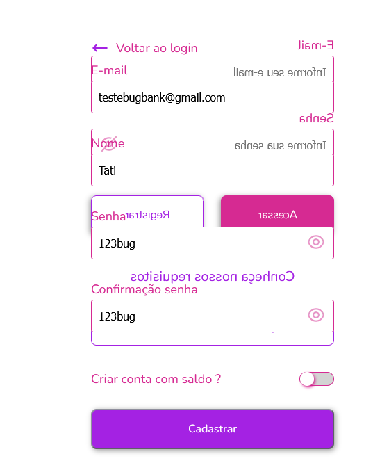

# 🐞 BUG-001 — Textos e elementos da interface aparecem invertidos

## Resumo

Alguns textos e elementos da interface de cadastro são apresentados de forma invertida/espelhada, dificultando a leitura e interação do usuário.

## Severidade

**Média**

## Prioridade

**Alta** 

## Tipo

**Usabilidade / Interface (UI)**

## Ambiente

- Aplicação: BugBank
- Navegador: Firefox
- Plataforma: Desktop
- Funcionalidade: Cadastro

## Pré-condições

- Aplicação BugBank acessível.
- Usuário na tela de cadastro.

## Passos para reprodução

1. Acessar a aplicação BugBank.
2. Acessar a tela de registrar.
3. Observar os textos e elementos apresentados na interface.
4. Verificar a orientação dos textos exibidos.

## Resultado esperado

Os textos, labels, placeholders e demais elementos da interface devem ser apresentados na orientação correta, permitindo leitura e interação normal pelo usuário.

## Resultado atual

Alguns textos e elementos da interface são apresentados de forma invertida/espelhada.

Exemplos observados durante o teste:

- Textos de orientação aparecem invertidos;
- Alguns elementos textuais apresentam leitura dificultada;
- O problema é perceptível na tela de cadastro.

## Impacto

O problema prejudica a legibilidade e pode dificultar a utilização da funcionalidade de cadastro.

## Evidência

## Status

**Aberto**

## Caso de teste relacionado

[CT-001 — Cadastro com dados válidos](../casos-de-teste.md#ct-001--cadastro-com-dados-válidos)
